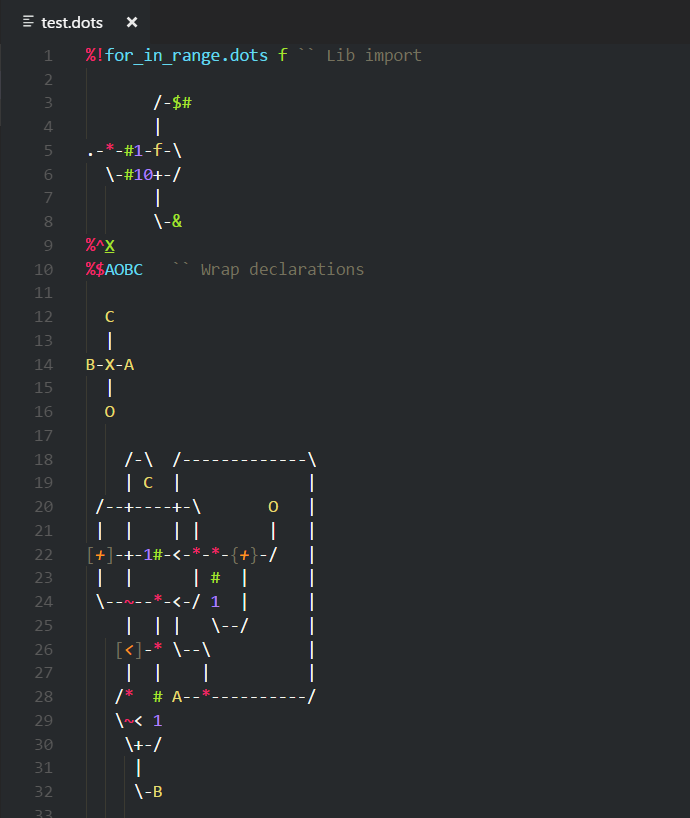

# Asciidots Support

This extention provides basic highlighting for [Asciidots](https://github.com/aaronduino/asciidots/) programs.

## Features

Now, it only highlights `.dots` files.
With the [Flatland-Monokai](https://marketplace.visualstudio.com/items?itemName=gerane.Theme-FlatlandMonokai) theme it looks like this:

## Requirements

Enjoy it !

## Known Issues

None... for now !

## Release Notes

### 1.0.0

Initial release of Asciidots Support

-----------------------------------

 Ce(tte) œuvre est mise à disposition selon les termes de la <a rel="license" href="http://creativecommons.org/licenses/by-sa/4.0/">Licence Creative Commons Attribution -  Partage dans les Mêmes Conditions 4.0 International</a>.